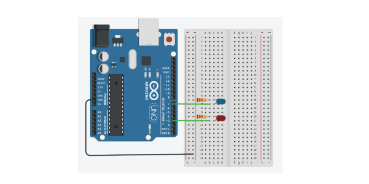
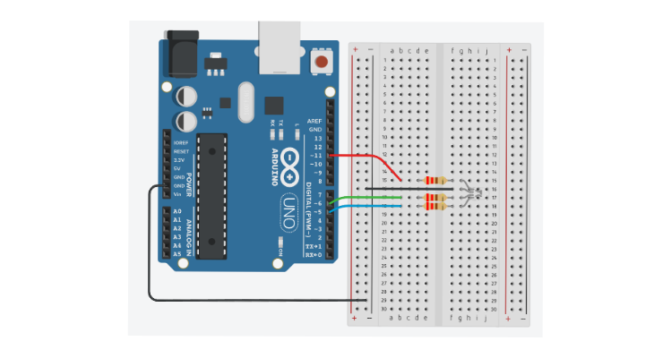
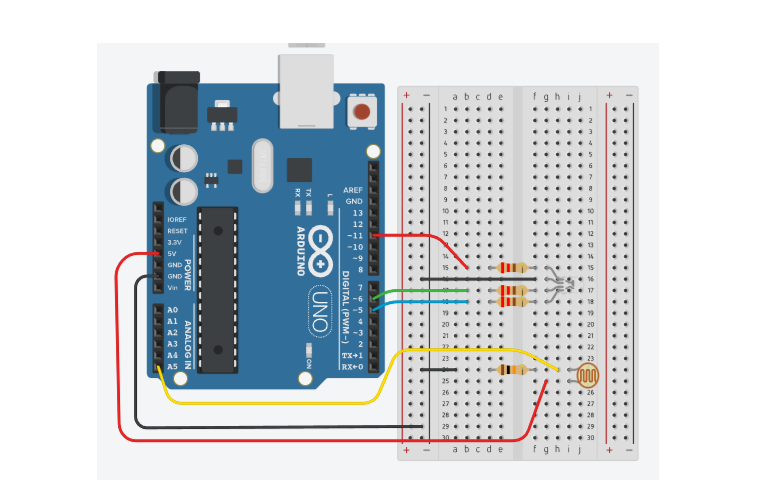

# Aula 02 - LEDs Externos, LED RGB, PWM, Funções e Sensor LDR

Segunda aula da disciplina de Monitoramento Ambiental - Sensores e Microcontroladores. Continuação da Aula 01, mantendo o trabalho em grupos (10 grupos) e o fluxo de desenvolvimento com **PlatformIO** a partir do Raspberry Pi acessado via SSH.

Nesta aula avançamos do LED embutido para **componentes externos**, introduzindo:

- ligação de LEDs externos com resistor;
- LED RGB e a saída **PWM** com `analogWrite()`;
- organização do código em **funções**;
- leitura de um **sensor de luz (LDR)** e o **Monitor Serial**.

## Materiais

- Arduino UNO + cabo USB
- Raspberry Pi, cartão de memória e fonte
- Adaptador VGA - HDMI, monitor, teclado e cabo de rede
- Protoboard e jumpers
- 1 LED branco e 1 LED azul
- 1 LED RGB (cátodo ou ânodo comum)
- 1 LDR (fotorresistor)
- 1 botão (*push-button*) — para o exercício final
- Resistores: 200 Ω (LEDs) e 10 kΩ (divisor de tensão do LDR)

---

## 1. Acesso ao Raspberry Pi e preparação do projeto

Como na aula passada, acesse o Raspberry Pi via SSH:

```bash
ssh nome@ip
```

Senha:

```text
iot***
```

Crie a pasta do primeiro exercício e inicialize o projeto PlatformIO:

```bash
mkdir ex1
cd ex1

pio project init --board uno
```

> A forma curta também funciona: `pio init -b uno`.

### Identificadores de placas no PlatformIO

O identificador (`board`) depende do hardware utilizado. Alguns dos mais comuns:

| Placa | Identificador (`board`) |
|-------|-------------------------|
| Arduino Uno | `uno` |
| Arduino Nano (ATmega328P) | `nanoatmega328` |
| Arduino Pro Mini | `pro8MHzatmega328` ou `pro16MHzatmega328` |
| Arduino Mega 2560 | `megaatmega2560` |
| Wemos D1 Mini (ESP8266) | `d1_mini` |
| NodeMCU 1.0 (ESP-12E) | `nodemcuv2` |
| NodeMCU 0.9 (ESP-12) | `nodemcu` |
| NodeMCU-32S (ESP32) | `esp32vn-iot-uno` |
| Heltec WiFi LoRa 32 V3/V4 | `heltec_wifi_lora_32_V3` |
| Raspberry Pi Pico | `pi_pico` |

> **Heltec V4:** utilize o identificador da V3 e aumente a memória para 16 MB no `platformio.ini`.

Como estamos usando o **Arduino Uno**, o `platformio.ini` deve estar igual ao da aula passada:

```ini
[env:uno]
platform = atmelavr
board = uno
framework = arduino
```

Para **ver** o conteúdo do arquivo:

```bash
cat platformio.ini
```

Para **editar**, use um editor de terminal (há outros, como o `nano`):

```bash
micro platformio.ini
```

> No editor `micro`: `Ctrl + S` salva, `Ctrl + Q` sai. Pressione `Enter` para confirmar o nome do arquivo (`platformio.ini`).

---

## 2. Exemplo 1 — Dois LEDs externos (branco e azul)

Neste exemplo ligamos **dois LEDs externos** ao Arduino: um branco (pino 3) e um azul (pino 7). Eles piscam de forma **alternada** — quando um acende, o outro apaga.

### Circuito

- LED branco: pino digital **3** → resistor de **220 Ω** → LED → GND
- LED azul: pino digital **7** → resistor de **220 Ω** → LED → GND

> O resistor limita a corrente e protege o LED e a placa. Sem ele o LED pode queimar.



### Código

Entre na pasta `src` e crie/abra o arquivo `main.cpp`:

```bash
cd src
micro main.cpp
```

```cpp
#include <Arduino.h>

// Tempos em milissegundos
const unsigned long tempo = 3000;
const int ledPinBranco = 3;
const int ledPinAzul = 7;

void setup()
{
    pinMode(ledPinBranco, OUTPUT);
    pinMode(ledPinAzul, OUTPUT);
}

void loop()
{
    digitalWrite(ledPinBranco, HIGH);
    digitalWrite(ledPinAzul, LOW);

    delay(tempo);

    digitalWrite(ledPinBranco, LOW);
    digitalWrite(ledPinAzul, HIGH);

    delay(tempo);
}
```

### Tipos de dados inteiros

Escolher o tipo correto evita desperdício de memória e erros de estouro (*overflow*). Por isso `tempo` é `unsigned long`:

| Tipo | Tamanho | Faixa de valores |
|------|---------|------------------|
| `int` | 2 bytes | -32.768 a 32.767 |
| `unsigned int` | 2 bytes | 0 a 65.535 |
| `long` | 4 bytes | ±2,1 bilhões |
| `unsigned long` | 4 bytes | 0 a 4,29 bilhões |

### Compilar e gravar

Dentro da pasta do projeto (`cd` para voltar da `src`, se necessário):

```bash
pio run
```

Quando a compilação terminar corretamente, aparecerá uma mensagem semelhante a:

```text
SUCCESS
```

Normalmente o PlatformIO detecta a porta USB automaticamente:

```bash
pio run -t upload
```

Caso existam várias portas USB, informe a porta manualmente:

```bash
pio run -t upload --upload-port /dev/cu.usbmodem1101
```

Descubra a porta com:

```bash
pio device list
```

---

## 3. Exemplo 2 — LED RGB piscando (vermelho, verde, azul)

Agora usamos um **LED RGB**, que combina três LEDs (vermelho, verde e azul) em um único componente. Cada cor é ligada a um **pino PWM** do Arduino — `~11`, `~6` e `~5` (os pinos marcados com `~`) — o que permite controlar o **brilho** de cada cor.

Aqui o LED pisca em sequência: **vermelho → verde → azul**, cada cor por 2 segundos.



> Cada perna colorida (R, G, B) recebe seu próprio resistor de 220 Ω; a perna do **cátodo comum** vai para o GND. Se o seu LED for de **ânodo comum**, o pino comum vai para o 5 V e a lógica das intensidades se inverte.

Crie o exercício:

```bash
cd ~
mkdir ex2
cd ex2
pio init -b uno
```

Edite o `src/main.cpp`:

```cpp
#include <Arduino.h>

const unsigned long tempo = 2000;
const int ledR = 11;   // pino PWM ~11
const int ledG = 6;  // pino PWM ~6
const int ledB = 5;  // pino PWM ~5

void setup()
{
    pinMode(ledR, OUTPUT);
    pinMode(ledG, OUTPUT);
    pinMode(ledB, OUTPUT);
}

void loop()
{
    analogWrite(ledR, 255);
    analogWrite(ledG, 0);
    analogWrite(ledB, 0);

    delay(tempo);

    analogWrite(ledR, 0);
    analogWrite(ledG, 255);
    analogWrite(ledB, 0);

    delay(tempo);

    analogWrite(ledR, 0);
    analogWrite(ledG, 0);
    analogWrite(ledB, 255);

    delay(tempo);
}

```

### `analogWrite()` e PWM

Diferente do `digitalWrite()` (só liga/desliga), o `analogWrite()` usa **PWM** (*Pulse Width Modulation*) para variar o **brilho** de cada cor. O PWM liga e desliga o pino muito rápido; a fração do tempo em que ele fica ligado (o *duty cycle*) define o brilho médio percebido.

O valor do `analogWrite()` vai de **0 a 255** (8 bits): `0` = apagado, `255` = brilho máximo, `127` ≈ metade do brilho. Ao misturar as três intensidades obtemos diferentes cores.

> **Atenção ao nome:** `analogWrite()` **não** escreve num pino analógico — ela gera PWM num pino digital marcado com `~`. Já `analogRead()` (que veremos no Exemplo 4) é que lê os pinos analógicos `A0`–`A5`.

Compile e grave como no exemplo anterior:

```bash
pio run
pio run -t upload
```

---

## 4. Exemplo 3 — Organizando o código com funções

O código do Exemplo 2 repete três vezes a mesma sequência de `analogWrite()`. Podemos **criar uma função** `escolhaCor()` que recebe as três intensidades como parâmetros, deixando o código mais limpo e reutilizável.

Crie o `ex3`:

```bash
cd ~
mkdir ex3
cd ex3
pio init -b uno
```

Como o `platformio.ini` é igual ao do `ex2`, podemos **copiar** o `main.cpp` do `ex2` e depois editá-lo:

```bash
cp ../ex2/src/main.cpp src/
micro src/main.cpp
```

```cpp
#include <Arduino.h>

const unsigned long tempo = 2000;
const int ledR = 11;   // pino PWM ~11
const int ledG = 6;  // pino PWM ~6
const int ledB = 5;  // pino PWM ~5

void escolhaCor(int valorR, int valorG, int valorB)
{
    analogWrite(ledR, valorR);
    analogWrite(ledG, valorG);
    analogWrite(ledB, valorB);
}

void setup()
{
    pinMode(ledR, OUTPUT);
    pinMode(ledG, OUTPUT);
    pinMode(ledB, OUTPUT);
}

void loop()
{
    escolhaCor(255, 50, 200);
}
```

```bash
pio run
pio run -t upload
```

---

## 5. Exemplo 4 — Sensor de luz (LDR) e Monitor Serial

No último exemplo adicionamos um **LDR** (fotorresistor), cuja resistência varia com a luz. Com ele o Arduino **mede a luminosidade** do ambiente e acende o LED RGB (em branco) somente quando está **escuro**. Também usamos o **Monitor Serial** para acompanhar o valor lido.

Como o `ex4` reaproveita todo o `ex3`, copie a pasta inteira:

```bash
cd ~
cp -r ex3 ex4
cd ex4
```

Depois edite o `src/main.cpp` para incluir o LDR:

```bash
micro src/main.cpp
```

### Circuito do LDR

O LDR é ligado em um **divisor de tensão** e lido no pino analógico `A5`:

- 5 V → LDR → nó de leitura (`A5`) → resistor de **10 kΩ** → GND



> O LED RGB continua ligado como nos Exemplos 2 e 3. A novidade é o **divisor de tensão** do LDR: conforme a luz muda, a tensão no nó central (lido em `A5`) varia entre 0 e 5 V, o que o `analogRead()` converte em um número de 0 a 1023.

### Código

```cpp
#include <Arduino.h>

const unsigned long tempo = 1000;
const int ledR = 11;      // pino PWM ~11
const int ledG = 6;     // pino PWM ~6
const int ledB = 5;     // pino PWM ~5
const int pinLDR = A5;   // entrada analógica (LDR)

void escolhaCor(int valorR, int valorG, int valorB)
{
    analogWrite(ledR, valorR);
    analogWrite(ledG, valorG);
    analogWrite(ledB, valorB);
}

void setup()
{
    Serial.begin(9600);

    pinMode(ledR, OUTPUT);
    pinMode(ledG, OUTPUT);
    pinMode(ledB, OUTPUT);

    pinMode(pinLDR, INPUT);
}

void loop()
{
    int luz = analogRead(pinLDR);

    if (luz > 850)
    {
        escolhaCor(0, 0, 0);        // muita luz: LED apagado
    }
    else
    {
        escolhaCor(255, 255, 255); // pouca luz: LED branco aceso
    }

    Serial.print("Luz: ");
    Serial.println(luz);

    delay(tempo);
}
```

### Conceitos novos

- **`analogRead(pinLDR)`** lê um valor de **0 a 1023** proporcional à tensão no pino.
- **`if / else`** decide o que fazer conforme o valor lido: acima de `850` (muita luz) apaga; abaixo (escuro) acende.
- **`Serial.begin(9600)`** inicia a comunicação serial; **`Serial.print` / `Serial.println`** enviam o valor para o computador.

### Monitor Serial

Para acompanhar os valores lidos:

```bash
pio device monitor --baud 9600
```

> Você pode fixar a velocidade no `platformio.ini` adicionando `monitor_speed = 9600`. Assim basta rodar `pio device monitor`.

Observe os números mudando ao **cobrir** o LDR (escuro → LED acende) e ao **iluminá-lo** (claro → LED apaga). Ajuste o limiar `850` conforme a iluminação da sala.

---

## Resumo dos comandos da aula

```bash
# Acesso
ssh nome@ip

# Novo projeto
mkdir exN && cd exN
pio init -b uno

# Editar arquivos
micro platformio.ini
micro src/main.cpp

# Reaproveitar código
cp ../ex2/src/main.cpp src/     # copiar um arquivo
cp -r ex3 ex4                   # copiar o projeto inteiro

# Compilar, gravar e monitorar
pio run
pio run -t upload
pio device list
pio device monitor --baud 9600
```
---

## Exercício final — Semáforo inteligente (LDR + botão)

Desafio: usando tudo que vimos na aula, montar e programar um **semáforo** em que o **LED RGB é o farol**. Junte o LED RGB, o LDR e um **botão** (o botão do pedestre).

### O que o semáforo deve fazer

1. **Dia (funcionamento normal):** o farol fica **variando lentamente** (cada fase com cerca de **7 segundos**), alternando entre **vermelho → verde → amarelo** e repetindo.
2. **Noite (o LDR detecta escuro):** o semáforo entra em modo de alerta e fica **apenas piscando o amarelo**.
3. **Botão do pedestre:** quando o usuário pressionar o botão, em **2 segundos** o farol deve ficar **vermelho** (para dar vez ao pedestre atravessar) e só depois voltar ao ciclo normal.

### Montagem

- **LED RGB (farol):** ligado como no Exemplo 4 — pinos PWM `~11`, `~6` e `~5`, cada cor com seu resistor de 220 Ω e o cátodo comum no GND.
- **LDR:** o mesmo divisor de tensão do Exemplo 4, lido em `A5`.
- **Botão:** um terminal no **pino 2** e o outro no **GND**. Usamos `INPUT_PULLUP`, então o pino fica em `HIGH` solto e vai para `LOW` quando o botão é pressionado — **sem precisar de resistor externo**.

### Dicas

- No RGB, **amarelo = vermelho + verde**: `escolhaCor(255, 255, 0)`. Se ficar esverdeado, reduza o verde (ex.: `escolhaCor(255, 100, 0)` para um âmbar).
- Cores do farol: `escolhaCor(255, 0, 0)` = vermelho, `escolhaCor(0, 255, 0)` = verde, `escolhaCor(255, 255, 0)` = amarelo, `escolhaCor(0, 0, 0)` = apagado.
- "Noite" é quando a leitura do LDR fica **abaixo** de um limiar (`limiarNoite`). Ajuste esse valor conforme a luz da sala (use o Monitor Serial para calibrar).
- **Problema do `delay()`:** durante uma espera longa (7 s) o programa fica "preso" e não percebe o botão. Para o botão responder rápido, criamos uma função `esperar()` que conta o tempo com `millis()` enquanto **fica de olho no botão** e avisa se ele foi pressionado.
