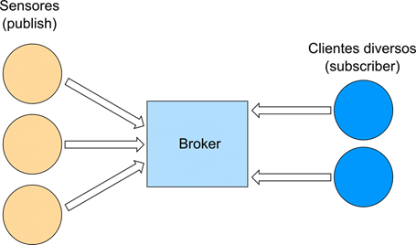

# Mensagens MQTT entre Raspberries

O MQTT (Message Queuing Telemetry Transport) é um protocolo de mensagens leve baseado no modelo de publicação e assinatura. Ele foi desenvolvido pela IBM e Eurotech na década de 90 e tem como propósito conectar pequenos dispositivos de Internet das Coisas (IoT) usando pouca energia e pouca internet, permitindo a troca rápida de dados entre máquinas.

O esquema de troca de mensagens é fundamentado no modelo Publicador-Subscritor, conforme ilustra a Figura abaixo, extremamente simples e leve. O protocolo segue princípios arquitetônicos que minimizam o uso de banda de rede e de recursos dos equipamentos, enquanto provê confiabilidade e algum nível de garantia de entrega. 



## Serviço e message broker Mosquitto

Um message broker (corretor de mensagens) é um software intermediário que gerencia a comunicação entre diferentes sistemas ou aplicativos. Ele recebe mensagens de um sistema remetente (produtor) e as entrega ao sistema destinatário (consumidor), permitindo que funcionem de forma separada e sem precisar falar o mesmo idioma.

O Eclipse Mosquitto é um *broker* de mensagens de código aberto (licenciado sob EPL/EDL) que implementa as versões 5.0, 3.1.1 e 3.1 do protocolo MQTT. O Mosquitto é leve e adequado para uso em diversos dispositivos, desde computadores de placa única de baixo consumo até servidores completos.

O protocolo MQTT oferece um método leve para a troca de mensagens utilizando um modelo de publicação/assinatura (*publish/subscribe*). Isso o torna ideal para mensagens na Internet das Coisas (IoT), como em sensores de baixo consumo ou dispositivos móveis — incluindo celulares, computadores embarcados ou microcontroladores.

O projeto Mosquitto também disponibiliza uma biblioteca em C para a implementação de clientes MQTT, bem como os populares clientes de linha de comando MQTT `mosquitto_pub` e `mosquitto_sub`.

## Verifique a instalação do Mosquitto

Para verificar se o serviço mosquitto está instalado e rodando no seu Raspberry digite no terminal:

```
sudo systemctl status mosquitto
````

Se estiver funcionando, deve aparecer algo como:

```
Active: active (running)
```

Para conferir se o Mosquitto está realmente escutando na porta MQTT padrão 1883:

```
sudo ss -ltnp | grep 1883
```

A resposta deve ser algo como `LISTEN 0      100                             0.0.0.0:1883       0.0.0.0:*    users:(("mosquitto",pid=914,fd=5))  `.

Para checar a versão do mosquitto instalado, rode:

```
mosquitto -h
```

Deve aparecer algo como:

```
mosquitto version 2.0.21

mosquitto is an MQTT v5.0/v3.1.1/v3.1 broker.
```

Ok, agora que já sabemos que temos um MQTT broker vamos mandar mensagens por ele.

## Conexão entre Raspberries e publish/subcribe MQTT messages

Para que cada Raspberry mande uma mensagem via MQTT - rede TCP/IP vamos fazer com que o Raspberry se conecte na rede wifi um do outro. O TCP/IP (também chamado de pilha de protocolos TCP/IP) é um conjunto de protocolos de comunicação entre computadores que estão ligados em rede. Seu nome vem de dois protocolos: o TCP (Transmission Control Protocol) e o IP (Internet Protocol).

Siga o passo a passo:

1) conecte o Dongle no raspberry para permitir ele se conectar noutra rede wifi.

2) Vamos verificar quais as redes estão disponíveis no seu Raspberry usando o NetworkManager. O nmcli (NetworkManager Command Line Interface) é uma ferramenta de linha de comando para controlar o NetworkManager e monitorar o status de redes em sistemas operacionais Linux. Digite no terminal:

```
nmcli dev status
```

A resposta deve ser algo como:

```
DEVICE      TYPE      STATE                   CONNECTION         
eth0        ethernet  connected               Wired connection 1 
lo          loopback  connected (externally)  lo                 
tailscale0  tun       connected (externally)  tailscale0         
wlan1       wifi      disconnected            --                 
wlan0       wifi      unmanaged               --          
```

O que isso quer dizer?

- `eth0` é a rede cabeada
- `wlan0` é a rede wi-fi gerada pelo próprio raspberry
- `wlan1` é o dongle (pequeno dispositivo conectado à entrada USB de um computador para fornecer acesso a redes sem fio).

Caso a sua rede `wlan1` esteja conectada a outra rede vamos ter que desconectar, para isso rode:

```
sudo nmcli device disconnect wlan1
```

Depois confirme:

```
nmcli dev status
```

Conecte-se à rede do Raspberry do Professor:

```
sudo nmcli dev wifi connect "mp-livre" password "iotempire"
```

Caso dê erro, siga o passo a passo:

### Conectar o Raspberry Pi à rede `mp-livre` usando `wlan1`

Primeiro, verifique como a rede Wi-Fi aparece e qual tipo de segurança está sendo utilizado:

```bash
nmcli -f SSID,SECURITY,SIGNAL dev wifi list
```

A rede deve aparecer aproximadamente assim:

```text
SSID       SECURITY
mp-livre   WPA2
```

Crie uma nova conexão Wi-Fi associada especificamente à interface `wlan1`:

```bash
sudo nmcli connection add type wifi ifname wlan1 con-name mp-livre ssid mp-livre
```

Configure o método de autenticação como **WPA/WPA2 Personal (PSK)**:

```bash
sudo nmcli connection modify mp-livre wifi-sec.key-mgmt wpa-psk
```

Configure a senha da rede:

```bash
sudo nmcli connection modify mp-livre wifi-sec.psk "iotempire"
```

Garanta que essa conexão seja utilizada especificamente pela interface `wlan1`:

```bash
sudo nmcli connection modify mp-livre connection.interface-name wlan1
```

Agora ative a conexão:

```bash
sudo nmcli connection up mp-livre
```

Por fim, verifique o estado das interfaces de rede:

```bash
nmcli dev status
```

O resultado esperado deve ser semelhante a:

```text
DEVICE  TYPE  STATE      CONNECTION
wlan1   wifi  connected  mp-livre
```

## Publique um tópico MQTT usano mosquitto


No Raspberry Pi que vai receber eu (professor) digita:

```
mosquitto_sub -h 192.168.6.1 -t "teste/mensagem"
```

Esse comando fica aguardando mensagens publicadas no tópico: `teste/mensagem`.

No Raspberry Pi que vai enviar, o/a discente deve digitar:

```
mosquitto_pub -h 192.168.6.1 -t "teste/mensagem" -m "Olá Raspberry!"
```

Envie o nome do seu Raspberry e o nome dos integrantes da equipe, tudo em apenas uma linha.
