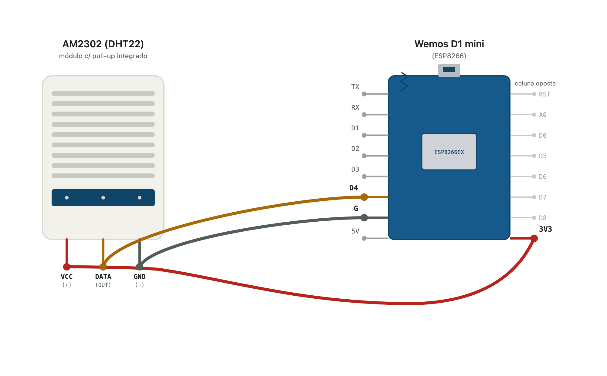

# Flashing do Wemos D1 mini - leitura de Temperatura e Umidade relativa do ar

Vamos configurar o Wemos para fazer a leitura do sensor AM2303 (temperatura e umidade) e enviar os dados via MQTT para o servidor MQTT (Mosquitto) instalado no Raspberry. Você pode desconectar o Dongle agora, não vamos mais usar.

Para isso você precisará:

1) Acessar o Raspberry remotamente ou localmente
2) Baixar usando o Git os arquivos do Github (https://github.com/emiliomercuri/monitoramento_ambiental/) até a pasta do Raspberry


O **Git** é um sistema de controle de versão distribuído, gratuito e de código aberto, criado por Linus Torvalds. Ele rastreia alterações em arquivos de código, permitindo que equipes colaborem em projetos de software com segurança, velocidade e histórico completo de modificações


## 1) Baixando os dados do Github usando o Git

Navegue até uma pasta do Raspberry Pi onde será realizada a aula, por exemplo, para voltar para a pasta do seu usuário faça:

```
cd ~
```

Entre na pasta do seu grupo:

```
cd grupo_X
```

Crie uma pasta para a Aula04:

```
mkdir Aula04_ESP8266_MQTT_T_UR_MP
```

Entre na pasta da aula:

```
cd Aula04_ESP8266_MQTT_T_UR_MP
```

Crie uma pasta com a atividade (Exercício 01)

```
mkdir ex01
```

Entre na pasta do exercício
```
cd ex01
```


Dentro desta pasta do Raspberry Pi, você pode baixar somente uma pasta do repositório da disciplina (https://github.com/emiliomercuri/monitoramento_ambiental/), sem trazer todo o conteúdo, usando `git sparse-checkout`.

Faça um clone parcial:

```
git clone --depth 1 --filter=blob:none --sparse \
https://github.com/emiliomercuri/monitoramento_ambiental.git
```

Entre no repositório:

```
cd monitoramento_ambiental
```

Agora selecione somente a pasta desejada. Como o caminho possui espaços e vírgulas, coloque-o entre aspas:

```
git sparse-checkout set "Aulas/Aula04-ESP8266_MQTT_T_UR_MP/codes/am2302
```

Usando o `micro` inspecione os arquivos que você baixou. Veja os arquivos `platformio.ini` e `main.cpp`. Copie o código deles no ChatGPT e pergunte o que eles fazem, discuta em aula com os colegas.

## 2) Conexões físicas entre o sensor AM2303 e o Wemos D1 mini

Faça as ligações dos jumpers da seguinte maneira, da esquerda para direita temos o AM2302 e Wemos, respectivamente:

- (+) VCC → 3V3 (alimentação)
- (out) DATA → D4 / GPIO2 (sinal)
- (-) GND → G (terra)

Ou de acordo com a figura abaixo:




## 3) Adaptando os arquivos para o seu servidor MQTT

Cara Raspberry Pi gera uma rede Wi-Fi que tem o mesmo nome do usuário (músico de uma banda famosa de rock inglês clássico). O professor instalou em cada Raspberry Pi um servidor Mosquitto que tem o IP do Wi-Fi gerado por cada Raspberry.

Você precisará adaptar o código `main.cpp` para que ele envie os dados via MQTT para o seu servidor MQTT.

Primeiro você deve descobrir qual é o IP do MQTT broker que o seu Raspberry está gerando no Wi-Fi. Para isso digite no terminal:

```
ifconfig
```

Procure o IP de `wlan0`, esse é o IP do seu MQTT broker, que será achado se você fizer o Wemos se conectar na rede wi-fi do seu Raspberry (usuario + senha padrão).

Para isso acesse `main.cpp` e troque o usuário e senha do Wi-Fi e depois o IP do seu MQTT broker. No caso do Raspberry Page é:

```
// ========================================================
// CONFIGURACOES Wi-Fi
// =======================================================
const char* WIFI_SSID = "page";
const char* WIFI_PASS = "iot******";
// =======================================================
// CONFIGURACOES MQTT
const char* MQTT_HOST = "192.168.4.1";
const uint16_t MQTT_PORT = 1883;
const char* MQTT_TOPIC_BASE = "sensores/am2302";
```

Agora você pode voltar para a pasta `am2302`, conectar o Wemos no seu Raspberry Pi e fazer o flash do Wemos:

```
pio run -t upload
```

Para verificar que o sensor e o wemos estão enviando os dados rode:

```
pio device monitor
```

deve aparecer algo como:

```
BOOT OK - AM2302 Wi-Fi MQTT
Board ID: ESP-D45CE8
Topico MQTT: sensores/am2302/ESP-D45CE8
Conectando ao Wi-Fi: page
status=7
status=7
status=7
status=7
status=7
status=7
status=3
Wi-Fi conectado.
IP: 192.168.4.38
RSSI: -39
Conectando ao MQTT... conectado.
AM2302 iniciado.
Temp: 19.00 C  Umidade: 55.70 %  MQTT: OK
Temp: 19.00 C  Umidade: 57.10 %  MQTT: OK
Temp: 19.00 C  Umidade: 57.10 %  MQTT: OK
Temp: 19.00 C  Umidade: 57.10 %  MQTT: OK
Temp: 19.00 C  Umidade: 57.10 %  MQTT: OK
```

Solte uma baforada forte no AM2302, veja a umidade relativa do ar subir. Depois segure por alguns minutos na sua mão o AM2302 e veja a temperatura subir.

Anote o tópico MQTT que está sendo enviado via internet:

```
Topico MQTT: sensores/am2302/ESP-D45CE8
```

Vamos usar isso mais tarde.

Agora escolha outra rede Wifi e IP de MQTT Broker (siga o que o professor está usando em aula) e envie os dados para lá, vamos fazer um exemplo em sala.