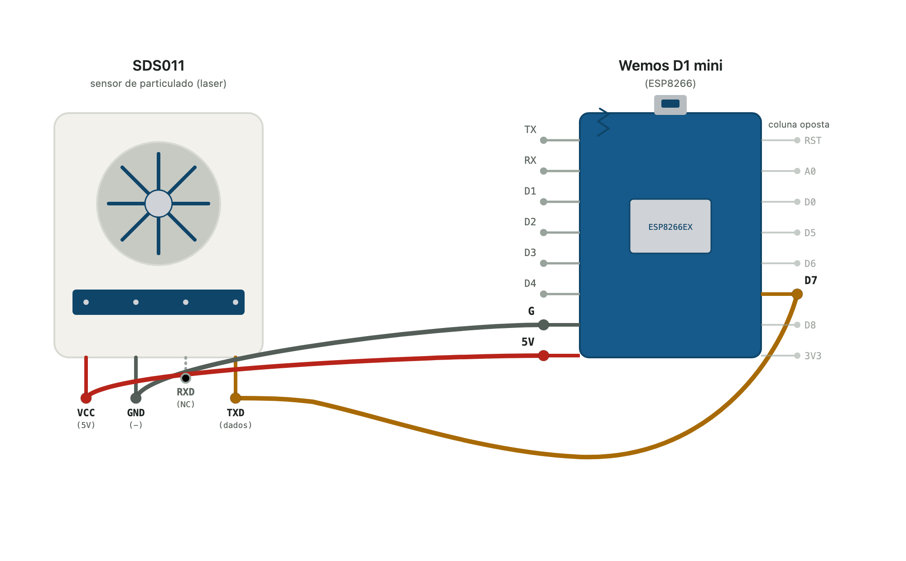

# Medição de Material Particulado

Vamos usar os sensores SDS011 (MP10 e MP2.5) e PMS7003 (MP10, MP2.5 e MP1.0).

Agora você pode adaptar os códigos que estão no github e fazer a parte inicial de enviar os dados via MQTT. As ligações físicas estão ilustradas abaixo.

## Ligação Física do SDS011

Veja na imagem:

- VCC → 5V (vermelho) — diferente do AM2302, o SDS011 precisa de 5V por causa da ventoinha e do laser.
- TXD → D7/GPIO13 (âmbar) - o fio contorna por baixo da placa porque D7 fica na coluna oposta do Wemos.
- GND → G (cinza).
- RXD → não conectado (pino tracejado/vazio) — o firmware só lê o que o sensor transmite sozinho, não precisa enviar comandos.

## Ligação Física do PMS7003

