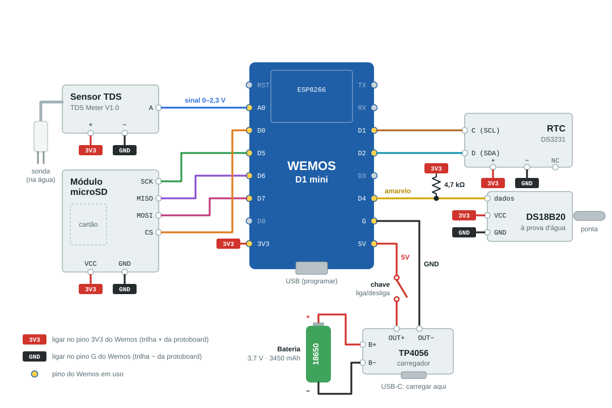

# Aula 07 - Condutivímetro, Temperatura da Água e Datalogger


Nesta aula vamos montar um **condutivímetro** que será usado no experimento de dispersão de sal em um córrego para o cálculo do coeficiente de difusão turbulenta. O equipamento deve medir a **condutividade elétrica** e a **temperatura da água** e gravar tudo, com **data e hora**, em um cartão microSD.

Desta vez vamos fazer diferente: em vez de ligar um sensor por vez, **ligamos o circuito inteiro de uma vez** e gravamos o **código completo**. Depois que o equipamento funcionar, a seção 7 mostra cada parte separadamente, para entender o código e para testar um componente quando algo não funcionar.

- **Seções 2 a 4:** ligar tudo, gravar o código completo e testar;
- **Seções 5 e 6:** montagem de campo (bateria, chave e caixa) e calibração;
- **Seção 7:** entendendo por partes (temperatura, condutividade, relógio e cartão SD).

## Materiais

- Wemos D1 mini (ESP8266) + cabo micro-USB
- Raspberry Pi
- Protoboard e jumpers
- Sensor **TDS** (TDS Meter V1.0) + sonda
- Sensor de temperatura **DS18B20** à prova d'água + resistor de **4,7 kΩ**
- Módulo **RTC DS3231**
- Módulo leitor de cartão **microSD** (SPI) + cartão microSD formatado em **FAT32**
- Bateria de lítio **18650** (3,7 V, 3450 mAh) + carregador **TP4056** (USB-C)
- Chave liga/desliga
- Caixa de proteção IP67

---

## 1. Acesso ao Raspberry Pi e preparação da aula

Como nas aulas anteriores, acesse o Raspberry Pi via SSH:

```bash
ssh nome@ip
```

Senha:

```text
iot***
```

Crie a pasta desta aula (todos os projetos ficarão dentro dela):

```bash
mkdir aula07
cd aula07
```

---

## 2. Ligando tudo de uma vez

Este é o circuito **completo**. Ligue todos os componentes agora, seguindo o esquema e a tabela.



Todos os módulos funcionam em **3,3 V**. Para não encher o Wemos de fios, use as trilhas laterais da protoboard:

- ligue o pino `3V3` do Wemos na trilha **+** e todos os `VCC`/`+` dos módulos nessa trilha;
- ligue o pino `G` do Wemos na trilha **−** e todos os `GND`/`−` dos módulos nessa trilha.

| Componente | Pino do componente | Wemos D1 mini | Observação |
|---|---|---|---|
| **Sensor TDS** | `A` (fio azul) | `A0` | sinal analógico, 0 a 2,3 V |
| | `+` (fio vermelho) | `3V3` | |
| | `−` (fio preto) | `G` | a sonda vai no conector branco de 2 pinos |
| **DS18B20** | amarelo (dados) | `D4` | |
| | vermelho (VCC) | `3V3` | |
| | preto (GND) | `G` | |
| | resistor de 4,7 kΩ | entre `D4` e `3V3` | obrigatório |
| **RTC DS3231** | `D` (SDA) | `D2` | I2C |
| | `C` (SCL) | `D1` | I2C |
| | `+` | `3V3` | |
| | `−` | `G` | |
| | `NC` | — | não ligar |
| **Módulo microSD** | `CS` | `D0` |  |
| | `MOSI` | `D7` | |
| | `MISO` | `D6` | |
| | `SCK` | `D5` | |
| | `VCC` | `3V3` | ver abaixo |
| | `GND` | `G` | |

> O TDS é analógico e o ESP8266 só tem **uma** entrada analógica (`A0`). O RTC usa o I2C, que no ESP8266 fica em `D1`/`D2`. O cartão SD usa o SPI (`D5`, `D6` e `D7`). O pino de dados do DS18B20 pode ser colocado em qualquer porta digital, mas como especificado no código usamos ele no `D4`.
>
> **Atenção:** a alimentação do módulo SD utilizado aqui (sem regulador) funciona em `3V3`. Muitos módulos no mercado operam em 5 V, como o utilizado na Aula 03. 

---
URL=https://raw.githubusercontent.com/emiliomercuri/monitoramento_ambiental/main/Aulas/Aula07/condutivimetro

## 3. Código completo — o datalogger

É o programa que vai para o rio: lê data e hora, temperatura e condutividade, mostra no Monitor Serial e grava no cartão SD.

### Criando o projeto

```bash
mkdir ex1
cd ex1

pio init -b d1_mini
```

### `platformio.ini`

```bash
micro platformio.ini
```

```ini
[env:d1_mini]
platform = espressif8266
board = d1_mini
framework = arduino
monitor_speed = 115200

lib_deps =
    paulstoffregen/OneWire
    milesburton/DallasTemperature
    adafruit/RTClib
    adafruit/Adafruit BusIO
```

Como na Aula 03, o `lib_deps` faz o PlatformIO **baixar e instalar sozinho** as bibliotecas na primeira compilação. É necessário acesso a internet!


### Código

```bash
micro src/main.cpp
```

```cpp
#include <Arduino.h>
#include <ESP8266WiFi.h>
#include <SPI.h>
#include <SD.h>
#include <OneWire.h>
#include <DallasTemperature.h>
#include <RTClib.h>

const unsigned long tempo = 1000;
const int pinTemp = D4;   // DS18B20
const int pinTDS  = A0;   // TDS
const int pinSD   = D0;   // CS do cartao SD

const float vRef = 3.2;   // tensao maxima do A0 do Wemos (V)
const float K    = 1.0;   // constante da celula de condutividade

OneWire oneWire(pinTemp);
DallasTemperature sensorTemp(&oneWire);
RTC_DS3231 rtc;

void setup()
{
    Serial.begin(115200);

    WiFi.mode(WIFI_OFF);   // desligar WiFi para economizar bateria

    pinMode(pinTDS, INPUT);

    sensorTemp.begin();

    if (!rtc.begin())
    {
        Serial.println("RTC nao encontrado!");
    }

    // quando verdadeiro, acerta com a data e hora da compilacao
    if (rtc.lostPower())
    {
        rtc.adjust(DateTime(F(__DATE__), F(__TIME__)));
    }

    Serial.println("Inicializacao do cartao SD...");

    if (!SD.begin(pinSD))
    {
        Serial.println("Inicializacao falhou !!");
        return;
    }

    File dados = SD.open("dados.txt", FILE_WRITE);

    if (dados)
    {
        dados.println("data_hora\ttemp(C)\ttensao(V)\tcond(uS/cm)");
        dados.close();
    }
}

void loop()
{
    // data e hora
    DateTime agora = rtc.now();
    char dataHora[] = "DD/MM/YYYY hh:mm:ss";
    agora.toString(dataHora);   // troca o modelo pela data e hora atuais

    // temperatura da agua
    sensorTemp.requestTemperatures();
    float temperatura = sensorTemp.getTempCByIndex(0);

    // condutividade
    float soma = 0;
    for (int i = 0; i < 20; i++)
    {
        soma = soma + analogRead(pinTDS);
        delay(10);
    }
    float leitura = soma / 20.0;
    float tensao = leitura * vRef / 1023.0;
    float tensao25 = tensao / (1.0 + 0.02 * (temperatura - 25.0));
    float condutividade = K * (133.42 * pow(tensao25, 3) - 255.86 * pow(tensao25, 2) + 857.39 * tensao25);

    // mostra no monitor serial
    Serial.print(dataHora);
    Serial.print("\t");
    Serial.print(temperatura);
    Serial.print("\t");
    Serial.print(tensao, 3);
    Serial.print("\t");
    Serial.println(condutividade);

    // grava no cartao SD
    File dados = SD.open("dados.txt", FILE_WRITE);

    if (dados)
    {
        dados.print(dataHora);
        dados.print("\t");
        dados.print(temperatura);
        dados.print("\t");
        dados.print(tensao, 3);
        dados.print("\t");
        dados.println(condutividade);
        dados.close();
    }
    else
    {
        Serial.println("problemas com o cartao!");
    }

    delay(tempo);
}
```

```bash
pio run -t upload
pio device monitor
```

Cada volta do `loop` leva cerca de **2 s** (1 s de `tempo` + ~0,75 s do DS18B20 + 0,2 s da média do TDS). Isso é suficiente para acompanhar a passagem da nuvem de sal pelo ponto de monitoramento.

### Acertando o relógio

Na primeira vez que o RTC é ligado, `rtc.lostPower()` é verdadeiro e o relógio é acertado com a **hora em que o código foi compilado**, isto é, a hora do Raspberry Pi. Depois disso a bateria do RTC mantém a hora, e as próximas gravações não mexem mais nele.

Para conferir a hora do Raspberry Pi:

```bash
date
```

> **A hora ficou errada?** Troque `if (rtc.lostPower())` por `if (true)`, grave o código uma vez, depois volte para `if (rtc.lostPower())` e grave de novo. Se ficar `if (true)`, o relógio volta para a hora da compilação toda vez que o Wemos religar.

---

## 4. Testando o equipamento

Com o Monitor Serial aberto, deve aparecer uma linha a cada ~2 s, com data e hora, temperatura, tensão e condutividade. Faça os testes:

1. **Temperatura:** aperte o sensor com a mão, a temperatura deve subir.
2. **Condutividade:** meça a água da torneira (algumas dezenas a poucas centenas de µS/cm). Depois dissolva uma pitada de sal e veja a condutividade subir.
3. **Hora:** compare com a saída do `date` no Raspberry Pi e com o teu relógio (e com a hora dos outros grupos).
4. **Cartão SD:** desligue o Wemos, tire o cartão e abra o `dados.txt` no computador.

Exemplo do arquivo `dados.txt`:

```text
data_hora	temp(C)	tensao(V)	cond(uS/cm)
30/09/2026 14:05:12	23.81	0.162	137.61
30/09/2026 14:05:14	23.81	0.164	139.38
```

O cabeçalho é gravado toda vez que o Wemos liga. Assim fica fácil ver no arquivo onde o equipamento foi religado.

> **Limite:** o sensor TDS mede até cerca de **2000 µS/cm** (1000 ppm).

---

## 5. Montagem de campo — bateria, chave e caixa

No rio não há computador. O Wemos passa a ser alimentado pela bateria 18650, e o carregador TP4056 permite recarregá-la pela entrada USB-C.

| De | Para |
|---|---|
| Bateria `+` | TP4056 `B+` |
| Bateria `−` | TP4056 `B−` |
| TP4056 `OUT+` | chave → Wemos `5V` |
| TP4056 `OUT−` | Wemos `G` |

A bateria (3,7 a 4,2 V) entra no pino `5V`, e o regulador do próprio Wemos gera os 3,3 V usados pelo ESP8266 e por todos os módulos.

> **Atenção:** **desligue a chave antes de ligar o cabo USB no Wemos** para gravar o código. Com a chave ligada, os 5 V do USB vão direto para a bateria pelo pino `5V`, sem controle de carga. Para carregar a bateria, use **sempre** o USB-C do TP4056.


---

## 6. Calibração — condutividade × concentração de sal

No experimento precisamos da **concentração de sal**, e não da condutividade. Por isso a sonda é calibrada **direto em concentração**, sem condutivímetro de referência: colocamos quantidades conhecidas de sal num volume conhecido de água e medimos a condutividade com a **própria sonda**.

O código não muda: deixe `K = 1.0`. A curva de calibração é aplicada depois, na análise dos dados.

### Material

- recipiente limpo com volume conhecido de água, por exemplo **V = 1 L**. Se possível, use água do **próprio córrego**;
- **o mesmo sal** que será lançado no córrego, seco;
- balança (resolução de 0,01 g), colher e bastão para mexer.

### Procedimento

1. Coloque a sonda do TDS e o DS18B20 na água, sem encostar no fundo nem na parede, e abra o Monitor Serial.
2. **Dose 0:** espere a leitura estabilizar e anote a condutividade da água sem sal adicionado.
3. Adicione **m gramas** de sal (por exemplo, **m = 0,1 g**), mexa até dissolver tudo e espere estabilizar.
4. Anote a condutividade: a média das últimas ~10 leituras estáveis.
5. Repita os passos 3 e 4, sempre com a mesma massa **m**, até chegar perto de **2000 µS/cm** (o limite do sensor).

A concentração **em excesso** (acima da que o córrego já tinha) depois de *n* doses é:

```text
C = n × m / V        (g/L, que é o mesmo que kg/m³)
```

### Tabela

| Dose (n) | Sal acumulado (g) | C (g/L) | Condutividade (µS/cm) |
|---|---|---|---|
| 0 | 0,0 | 0,0 | |
| 1 | 0,1 | 0,1 | |
| 2 | 0,2 | 0,2 | |
| … | … | … | |
| 8 | 0,8 | 0,8 | |

Com a tabela, ajusta-se a curva **C = f(condutividade)** (reta ou polinômio de grau 2). No **Dispersion Analyzer**, aba *2. Calibração*, tipo *Padrões de sal medidos com a sonda*: digite a concentração (g/L) ou o nº de doses, com a massa por dose e o volume.

> **Cada sonda tem a sua curva.** Faça a calibração com o condutivímetro de cada grupo e anote na tabela o número da sonda.

---

## 7. Entendendo por partes

O circuito já está todo ligado, então cada exemplo abaixo é só um **programa menor**, que usa um componente por vez. Serve para:

- entender cada bloco do código completo;
- descobrir qual componente está com problema.

Cada exemplo é um projeto novo, criado a partir de uma cópia do projeto completo. Assim o `platformio.ini`, com todas as bibliotecas, já vem pronto e só o `src/main.cpp` que muda. Na pasta da aula:

```bash
cd ~/aula07
cp -r ex1 ex2
cd ex2
micro src/main.cpp
```

(Para os outros exemplos, troque `ex2` por `ex3`, `ex4` e `ex5`.)

### Exemplo 1: Temperatura da água com o DS18B20

**Fios usados:** amarelo (dados) em `D4`, vermelho em `3V3`, preto em `GND` e o **resistor de 4,7 kΩ** entre `D4` e `3V3`.

O DS18B20 usa o protocolo **1-Wire**: um único fio leva os dados nos dois sentidos, e por isso ele precisa do resistor de *pull-up* de 4,7 kΩ mantendo a linha em nível alto. Assim como o DHT da Aula 03, o sensor já entrega o valor **pronto em °C**. Quem cuida da comunicação é a biblioteca.

```cpp
#include <Arduino.h>
#include <OneWire.h>
#include <DallasTemperature.h>

const unsigned long tempo = 2000;
const int pinTemp = D4;   // fio de dados (amarelo) do DS18B20

OneWire oneWire(pinTemp);
DallasTemperature sensorTemp(&oneWire);

void setup()
{
    Serial.begin(115200);

    sensorTemp.begin();
}

void loop()
{
    sensorTemp.requestTemperatures();                   // pede uma nova medicao
    float temperatura = sensorTemp.getTempCByIndex(0);  // le o primeiro sensor, em graus Celsius

    Serial.println(temperatura);

    delay(tempo);
}
```

```bash
pio run -t upload
pio device monitor
```

> **Apareceu −127?** O sensor não foi encontrado. Confira o fio de dados no `D4` e o resistor de 4,7 kΩ.

### Exemplo 2: Condutividade elétrica com o sensor TDS

**Fios usados:** TDS com `A` em `A0`, `+` em `3V3`, `−` em `GND` e a sonda no conector branco de 2 pinos. O DS18B20 continua sendo usado, para a correção de temperatura.

A sonda tem dois eletrodos. A placa aplica uma tensão alternada entre eles e mede quanta corrente passa pela água. Quanto mais sal dissolvido, mais íons, mais corrente, e maior a tensão de saída no pino `A` (de 0 a 2,3 V).

O código faz três contas:

1. **Leitura para tensão:** o `analogRead` devolve de 0 a 1023. No D1 mini o `A0` vai de 0 a **3,2 V**, então `tensao = leitura * 3,2 / 1023`.
2. **Correção de temperatura:** a condutividade sobe cerca de **2% por °C**. Para comparar medições feitas em temperaturas diferentes, tudo é convertido para **25 °C**:

   `tensao25 = tensao / (1 + 0,02 × (T − 25))`

3. **Tensão para condutividade:** curva fornecida pelo fabricante do sensor, em µS/cm:

   `CE = K × (133,42 × V³ − 255,86 × V² + 857,39 × V)`

   Deixe `K = 1`: a calibração (seção 6) é feita depois, direto em concentração de sal.

```cpp
#include <Arduino.h>
#include <OneWire.h>
#include <DallasTemperature.h>

const unsigned long tempo = 2000;
const int pinTemp = D4;   // DS18B20
const int pinTDS  = A0;   // sensor TDS

const float vRef = 3.2;   // tensao maxima do A0 do Wemos (V)
const float K    = 1.0;   // constante da celula de condutividade

OneWire oneWire(pinTemp);
DallasTemperature sensorTemp(&oneWire);

void setup()
{
    Serial.begin(115200);

    pinMode(pinTDS, INPUT);

    sensorTemp.begin();
}

void loop()
{
    // temperatura da agua
    sensorTemp.requestTemperatures();
    float temperatura = sensorTemp.getTempCByIndex(0);

    // leitura do TDS: media de 20 leituras para reduzir o ruido
    float soma = 0;
    for (int i = 0; i < 20; i++)
    {
        soma = soma + analogRead(pinTDS);
        delay(10);
    }
    float leitura = soma / 20.0;              // 0 a 1023

    float tensao = leitura * vRef / 1023.0;   // em volts

    // correcao de temperatura (referencia 25 C)
    float tensao25 = tensao / (1.0 + 0.02 * (temperatura - 25.0));

    // curva do fabricante: tensao -> condutividade (uS/cm)
    float condutividade = K * (133.42 * pow(tensao25, 3) - 255.86 * pow(tensao25, 2) + 857.39 * tensao25);

    Serial.print(temperatura);
    Serial.print("\t");
    Serial.print(tensao, 3);
    Serial.print("\t");
    Serial.println(condutividade);

    delay(tempo);
}
```

```bash
pio run -t upload
pio device monitor
```

**Teste:** água da torneira, depois uma pitada de sal. Se a `tensao` não muda, o problema está na ligação do TDS ou na sonda.

### Exemplo 3: Data e hora com o RTC DS3231

**Fios usados:** `D` (SDA) em `D2`, `C` (SCL) em `D1`, `+` em `3V3`, `−` em `GND`. O pino `NC` fica sem ligação.

No experimento de dispersão o horário é essencial: é com ele que calculamos quanto tempo o sal levou para chegar a cada ponto. O ESP8266 não sabe que horas são, e perde a contagem quando desliga. O **RTC** (*Real Time Clock*) é um relógio com bateria própria que continua contando mesmo com o sistema desligado. Ele conversa com o Wemos pelo **I2C** (dois fios: dados `SDA` e *clock* `SCL`).

```cpp
#include <Arduino.h>
#include <RTClib.h>

const unsigned long tempo = 1000;

RTC_DS3231 rtc;

void setup()
{
    Serial.begin(115200);

    if (!rtc.begin())
    {
        Serial.println("RTC nao encontrado!");
    }

    // acerta com a data e hora da compilacao
    if (rtc.lostPower())
    {
        rtc.adjust(DateTime(F(__DATE__), F(__TIME__)));
    }
}

void loop()
{
    DateTime agora = rtc.now();
    char dataHora[] = "DD/MM/YYYY hh:mm:ss";
    agora.toString(dataHora);   // troca o modelo pela data e hora atuais

    Serial.println(dataHora);

    delay(tempo);
}
```

```bash
pio run -t upload
pio device monitor
```

### Exemplo 4: Cartão SD

**Fios usados:** `CS` em `D0`, `MOSI` em `D7`, `MISO` em `D6`, `SCK` em `D5`, `VCC` em `3V3` e `GND` em `GND`.

O cartão usa o **SPI**, como na Aula 03. Três fios são compartilhados (`MOSI`, `MISO` e `SCK`) e o `CS` escolhe com qual dispositivo o Wemos está falando. No código completo:

- o `SD.begin(pinSD)` inicia o cartão no `CS = D0`;
- o `SD.open("dados.txt", FILE_WRITE)` abre o arquivo para **acrescentar** linhas no final (não apaga o que já estava gravado);
- o arquivo é fechado com `close()` a cada linha. Assim, se a bateria acabar, só se perde a última medição.

Este programa só grava uma linha de teste:

```cpp
#include <Arduino.h>
#include <SPI.h>
#include <SD.h>

const int pinSD = D0;   // CS do cartao SD

void setup()
{
    Serial.begin(115200);

    Serial.println("Inicializacao do cartao SD...");

    if (!SD.begin(pinSD))
    {
        Serial.println("Inicializacao falhou !!");
        return;
    }

    File teste = SD.open("teste.txt", FILE_WRITE);

    if (teste)
    {
        teste.println("teste de gravacao");
        teste.close();
        Serial.println("gravou teste.txt");
    }
    else
    {
        Serial.println("problemas com o cartao!");
    }
}

void loop()
{
}
```

```bash
pio run -t upload
pio device monitor
```

Se aparecer `gravou teste.txt`, o cartão está funcionando.
